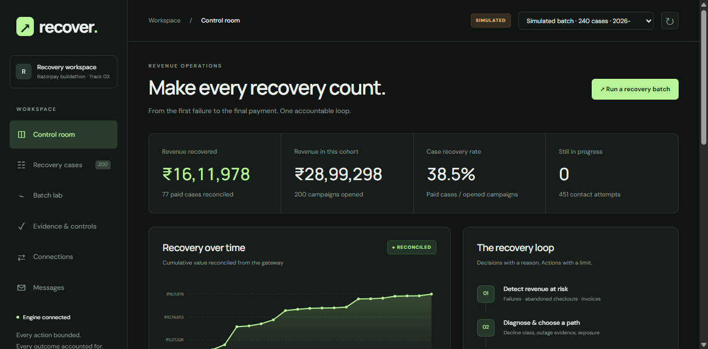

# Recover — Revenue Recovery Engine

Diagnosis-aware, bounded recovery for Razorpay test accounts. Detect unpaid
revenue, choose a recovery path, request SMS/email, interpret customer replies,
and count recovery only after a gateway outcome confirms payment.

Built for [Razorpay AI Buildathon — Track 03](https://razorpay.com/buildathon/).



## Run locally

Requires Python 3.11+.

```bash
python -m pip install -e '.[dev]'
python -m scripts.serve
```

Open **http://127.0.0.1:8000**. No keys are needed for the batch lab.

1. Run the 240-case synthetic demo and inspect the complete cohort.
2. Open a case to see its diagnosis, schedule, controls and append-only audit.
3. Import `samples/review-demo.csv`: two valid rows, one duplicate and one invalid
   amount. Open `order_review_demo`, read `STOP`, then apply the opt-out.
4. Open **Connections** to verify your own Razorpay **test** keys. Live keys are
   rejected; account records are separated by verified key identity.
5. Preview the account, then explicitly create a bounded batch of test links.
   Enable SMS/email only for recipients you have permission to contact.
6. Inspect **Messages** and export evidence. Requested is not delivered, and a
   created link is not recovered revenue.

## What works

- Decline classification, statistical degradation diagnosis, and persisted
  per-case schedules across failed payments, abandoned checkouts and receivables.
- Fresh obligation-state and balance checks; duplicate-obligation suppression.
- Just-in-time replacement-link cancellation after policy and budget checks.
- Write-ahead attempts, stable operation keys, uncertain-write reconciliation.
- Customer opt-out, quiet hours, contact caps, promises and human escalation.
- Optional Gemini reply interpretation with deterministic validation and a safe
  unavailable-model fallback; English, Hindi and Hinglish reply support.
- Razorpay-native SMS/email requests, one-time existing-link notifications,
  account-scoped signed webhooks, and separate notification audit states.
- Reproducible synthetic batch evidence and a tested FastAPI/vanilla-JS console.

## Evidence and boundaries

The complete regression suite, HTTP integration tests and browser review are
documented in [the final audit](docs/FINAL_REVIEW.md). Tests use synthetic data
and mocked outbound provider calls. Run them yourself:

```bash
python -m pytest -q
node --check ui/control/app.js
node --check ui/control/connections.js
```

Synthetic recovery totals measure engine behavior under a stated customer model,
not production cash or causal uplift. The Razorpay adapter cannot charge saved
mandates; that path is simulated. Payment-method exclusions are intent, not a
verified enforcement claim. Native notification delivery has not been verified
at a real inbox/handset.

Connections keep secrets in server memory for eight hours; reconnect after a
restart. This is a **single-process buildathon prototype**, not a hardened
multi-tenant SaaS. Remote use requires HTTPS and an operator token. Customer
self-service token routes currently belong to the server workspace; native
notification templates do not automatically contain an unsubscribe URL.

This public source copy intentionally excludes original Git history, `.env`,
private account ledgers, operational databases and generated customer data.
The historical research specification and frozen synthetic detector evaluations
are retained separately from the current application evidence.

## Documentation

- [Five-minute pitch and submission checklist](docs/BUILDATHON.md)
- [Architecture](docs/ARCHITECTURE.md)
- [Account connection and messaging](docs/CONNECTIONS.md)
- [Operations](docs/OPERATIONS.md)
- [Final review and remaining evidence gaps](docs/FINAL_REVIEW.md)

Public source is only part of submission. The applicant must supply their own
pitch video, explain the system and meet the program's eligibility requirements.
