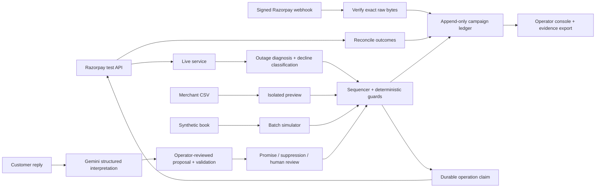

# Architecture

## Runtime

`python -m scripts.serve` starts FastAPI on `127.0.0.1:8000`. The server serves
`ui/control/`, operator APIs, verified Razorpay callbacks and signed customer
pages. The existing static console is preserved separately.

The server runs one process. JSONL is the source of truth for campaigns, contacts,
promises and review. Mutating live entry points use the same exclusive lock as
the CLI. The SQLite create journal claims `(test account, derived operation key)`
atomically before any Payment Link POST. After an ambiguous response, a later
request searches the provider by reference. If no authoritative result can be
found, the operation remains unresolved and no second POST is sent.

The live service verifies each underlying obligation directly, so a capped list
response cannot make a disappeared record look paid or unpaid. Before another
contacting rung it retires previous active links. Provider state failures hold
that case, while other verified cases can progress.

## Data boundaries

| Data | Location | Meaning |
| --- | --- | --- |
| Live test ledger | `data/live/dunning_ledger.jsonl` | Existing Razorpay test account campaign records |
| Operation claims | `data/live/operations.sqlite3` | Durable outbound create identities; back up with ledger |
| Batch records | `data/console/<run-id>/` | A distinct synthetic run or imported preview |
| Batch metadata | `<run-id>/job.json` | Seed, horizon, progress and ledger invariant results |
| Original research | `data/frozen/` | Frozen attribution evaluation |
| Secrets | ignored `.env` | Never returned to the browser |

A batch job remains visible after a restart. An interrupted job is marked
interrupted, never complete; a new batch gets a new directory. Evidence downloads
return the exact JSONL records plus a SHA-256 response header.

## AI authority

The language model sees customer reply text, the reference date and the case
amount. It proposes a structured intent and date. It cannot select gateway
credentials, change an amount, create a charge, or bypass contact guards.
The server stores the proposal temporarily and applies that exact reviewed
reading; it does not ask the model again at confirmation time.

Promises pass date/horizon validation. An explicit STOP has a deterministic
fallback. A dispute or unreadable reply stops an active campaign into a human
review queue. Resolving the review records a reason and leaves the campaign
stopped; automatic resumption is deliberately not implemented.

## Security and deployment boundary

Browser-connected test accounts use an HttpOnly opaque session backed by
in-memory credentials and key-scoped ledger directories. Connection verification
is read-only. Workspace ownership checks cover jobs, cases, exports and reply
proposals. Account-specific callback paths verify that account's signing secret.
Notification POSTs are write-ahead journalled and are not automatically retried.
See [Connections](CONNECTIONS.md) for credential lifetime and messaging limits.

Browser operator calls require a custom header, same-origin requests and an
allowlisted Host. Remote access additionally requires a configured 32+ character
admin token. Customer tokens and provider HMACs authorize only narrow public
actions. GET opt-out renders a confirmation form; POST performs the mutation,
avoiding opt-outs triggered by mail-link scanners.

The reference deployment is a local, single-process buildathon service. For a
hosted service use TLS, persistent volumes, a secret manager, proper operator
accounts and role-based access, durable jobs, transactional campaign storage,
central locks, retention rules and an audited provider integration. Do not run
multiple Uvicorn workers over these file ledgers.
